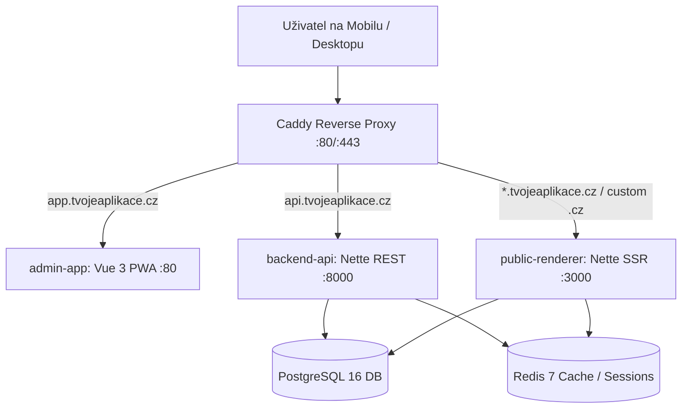

# Globální Architektura Systému

## 1. Context & Přehled
Web-Light-CRM je multi-tenant headless SaaS systém navržený pro řemeslníky, kadeřnice a lokální služby v ČR. Umožňuje z mobilního telefonu vytvořit do 3 minut kompletní web se zadaným IČO přes ARES, spravovat poptávky (CRM) a prezentovat služby na vlastní subdoméně nebo `.cz` doméně.

## 2. Aplikační Vrstvy

### 1. `admin-app` (Mobile-First SPA/PWA)
- **Framework:** Vue 3 (Composition API `<script setup lang="ts">`) + Vite 6 + Tailwind CSS v4.
- **Role:** Anonymní onboarding (Kroky 1–5), správa poptávek s nativními akcemi (`tel:`, `sms:`), formulářový editor obsahu a nastavení předplatného.
- **Target rozlišení:** 320px – 440px mobilní kontejner.

### 2. `backend-api` (Stateless REST API)
- **Framework:** PHP 8.3 + Nette DI/Http + Doctrine Migrations.
- **Autentizace:** JWT Access Token (15 min) + Refresh Token rotace v Redis (90 dní), podpora Seznam.cz, Google, Apple ID a 6místného Magic Link PINu.
- **Integrace:** ARES API (stahování adres a názvů dle IČO < 1.5s), Wedos WAPI (automatický nákup `.cz` domén).

### 3. `public-renderer` (SSR Website Engine)
- **Framework:** PHP 8.3 + Latte 3 templates + Chameleon Engine.
- **Role:** Server-side vykreslování výsledného HTML webu živnostníka na základě uloženého JSON profilu.
- **Cachování:** Redis HTML Cache (60s TTL) s okamžitým cache-bustingem při uložení změn v administraci.

### 4. `proxy` (Caddy 2)
- **Role:** Automatické **On-Demand TLS** certifikáty pro vlastní `.cz` domény a wildcard SSL pro subdomény dotazem na endpoint `/api/v1/domains/check`.
