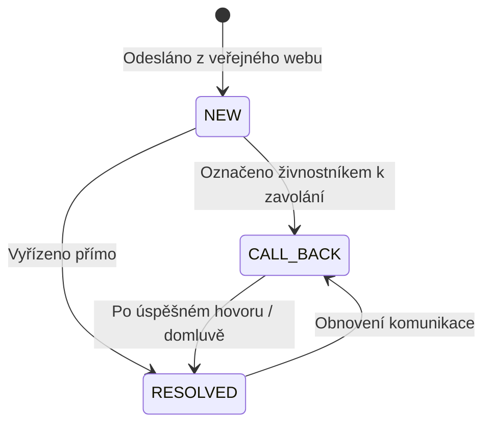

# CRM Poptávky (Leads) Model

## 1. Struktura Entity `LeadDTO`
- `lead_id`: UUID
- `business_id`: UUID tenantu
- `sender_name`: Jméno odesílatele poptávky
- `sender_phone`: Telefonní kontakt
- `sender_email`: Volitelný e-mail
- `message`: Text poptávky
- `status`: `LeadStatus` (`NEW` | `CALL_BACK` | `RESOLVED`)
- `reminder_at`: Datum a čas připomenutí (odložená notifikace)
- `created_at`: Časové razítko vytvoření

---

## 2. Stavový Automat

