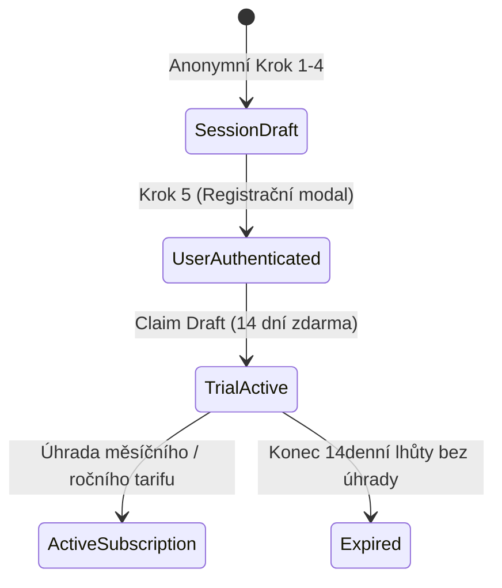

# Doménový Model: User, Business & Subscription

## 1. Entity & Value Objects

### `BusinessId`
- Typově bezpečný Value Object obalující UUID v4.

### `Money`
- Reprezentuje finanční částku v celých haléřích (`amount: int`) s měnou (`currency: string = 'CZK'`).
- Metoda `add(Money $other)` striktně kontroluje shodu měn.

### Backed Enums
- **`Archetype`:** `PROVOZOVNA` | `VYJEZDOVE_REMESLO` | `ZAKAZKOVA_VYROBA` | `OSTATNI`
- **`SubscriptionStatus`:** `TRIAL` | `ACTIVE` | `EXPIRED` | `CANCELLED`
- **`SubscriptionPlan`:** `MONTHLY` (250 Kč) | `ANNUAL` (2 500 Kč + `.cz` doména)
- **`CustomDomainStatus`:** `NONE` | `PENDING` | `ACTIVE` | `ERROR`
- **`AuthProviderType`:** `SEZNAM` | `GOOGLE` | `APPLE` | `EMAIL_MAGIC_LINK`

---

## 2. Životní cyklus (Onboarding Draft → Claimed Business)

